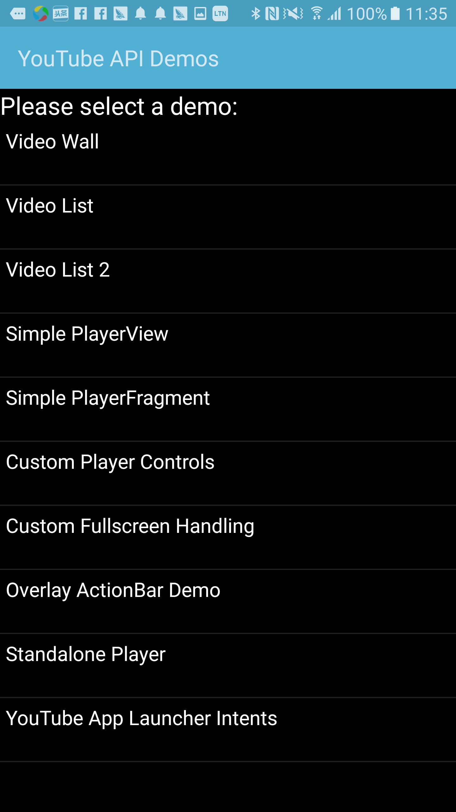
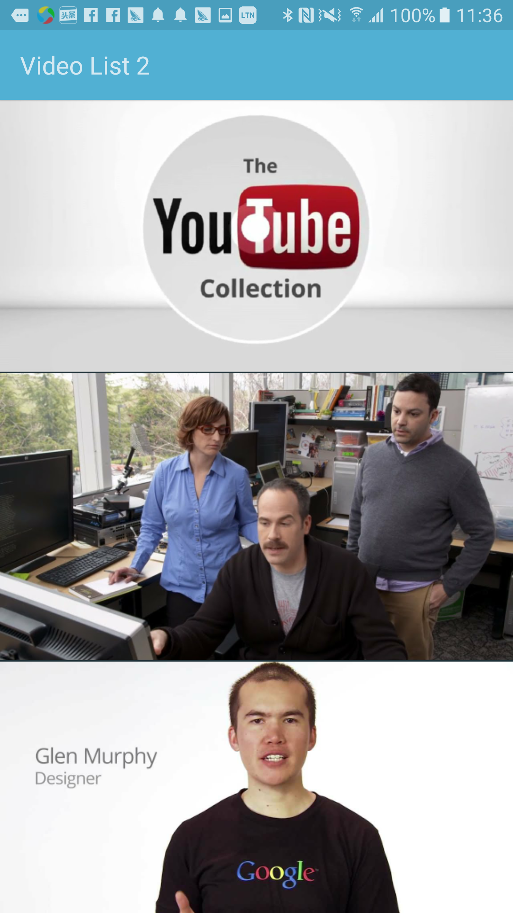
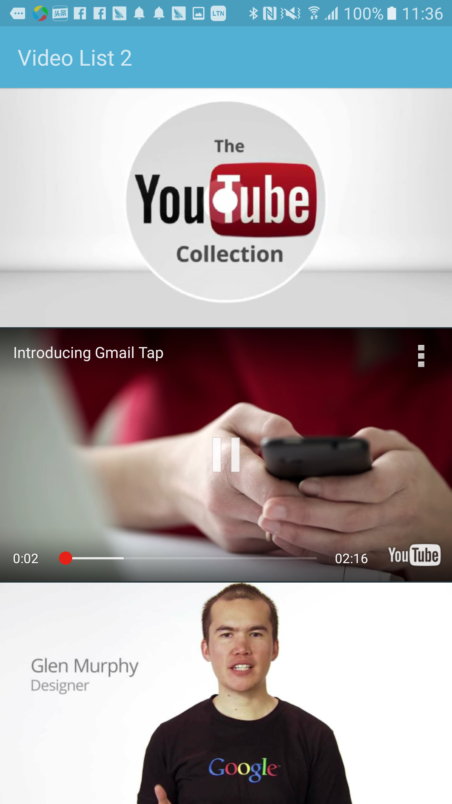
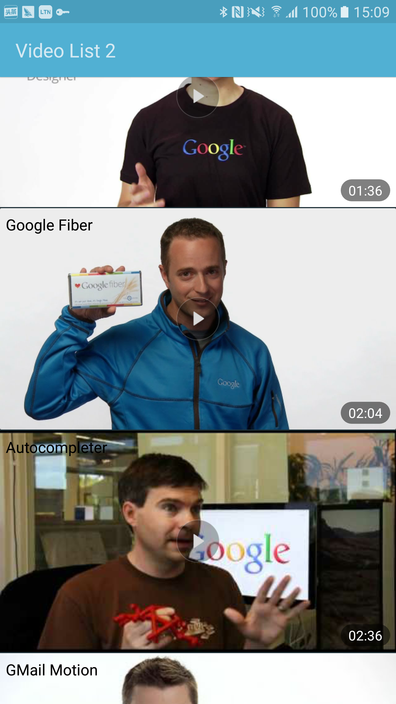

# YoutubeAndroidSample
### 简阅：<a id="orgheadline1"></a>

    本Sample直接在官方给的demo上做修改，涉及到的功能点完全可以和一个线上的app相媲美，在此先说下我在实战中踩的一些坑吧和相应的解决办法，相信这样能更快的击中大家的兴趣点；该项目也会持续维护，也欢迎大家多提意见，欢迎star，欢迎提交issues；谢谢

<p></p>

> **情景一：手机上安装并启用了YouTube：**

* **坑1：在Fragment中的如何使用YouTubePlayerView？**
* **坑2：如何编写视频列表，点击列表的item在当前行上直接播放？**
* **坑3：为什么有时候视频播着几秒后自动停止了？**
* **坑4：为什么有时候视频播着就闪退了？**
* **坑5：当播放的视频暂停后如何续播当前视频**
* **坑6：当播放的视频资源释放后如何续播上一个视频？**
* **坑7：当未启动YouTube客户端的时候，在某些手机下视频播放几秒后自动闪退了，比如OnePlus ONE A2001机型或其它大陆版的机型**
* **坑8：如何让播放视频前先播放广告？**

> **情景二：手机上未安装或者未启用YouTube：**

* **坑9：如何播放YouTube视频？**
* **坑10：如何适配播放器在各种分辨率下的宽高？**
* **坑11：如何监听播放状态？**
* **坑12：播放器上为啥没有全屏按钮显示？**
* **坑13：如何添加全屏播放功能？**
* **坑14：为何有些视频在手机上播放不了，但能在网页上播放？**
* **坑15：如何检测播放出错的监听事件?**

<font color="red" size="4"> 注：以上两种情景都需要在连接VPN的情况下测试 </font>

### Screenshots







###关于我

* **QQ:** 907167515
* **微信:** faith-hb
* **Weibo:** [http://weibo.com/234351856/home?wvr=5](http://weibo.com/234351856/home?wvr=5)
* **Email:** [hongbinghp@163.com](mailto:hongbinghp@163.com) | [hongbinghp@gmail.com](mailto:hongbinghp@gmail.com)
* **Github:** [https://github.com/faith-hb](https://github.com/faith-hb)
* **Blog:** [http://blog.csdn.net/hongbingfans](http://blog.csdn.net/hongbingfans)

###License

```
Copyright (c) 2016 [hongbinghp@163.com | hongbinghp@gmail.com]

Licensed under the Apache License, Version 2.0 (the "License”);
you may not use this file except in compliance with the License.
You may obtain a copy of the License at
   
   http://www.apache.org/licenses/LICENSE-2.0

Unless required by applicable law or agreed to in writing, software
distributed under the License is distributed on an "AS IS" BASIS,
WITHOUT WARRANTIES OR CONDITIONS OF ANY KIND, either express or implied.
See the License for the specific language governing permissions and
limitations under the License.
```
